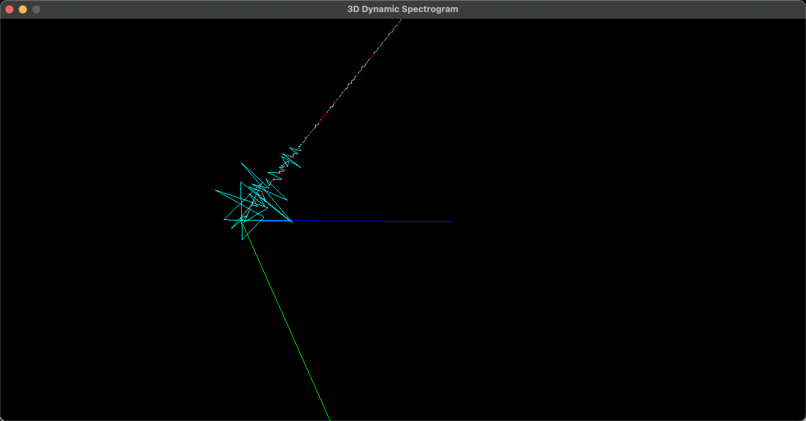

# AudioProcess
 This program is designed to run in the macOS environment. 
 And the sound should output with Multi-Output Device which include Build-in speaker and 
 BlackHole 2ch(virtual audio loopback driver)

Function:

The program will catch the sound which displayed by macbook build-in speaker and generate the following spectrogram.

Player and 2D Static Spectrogram:

2D Time-Varying Spectrogram:

3D Time-Varying Spectrogram:

